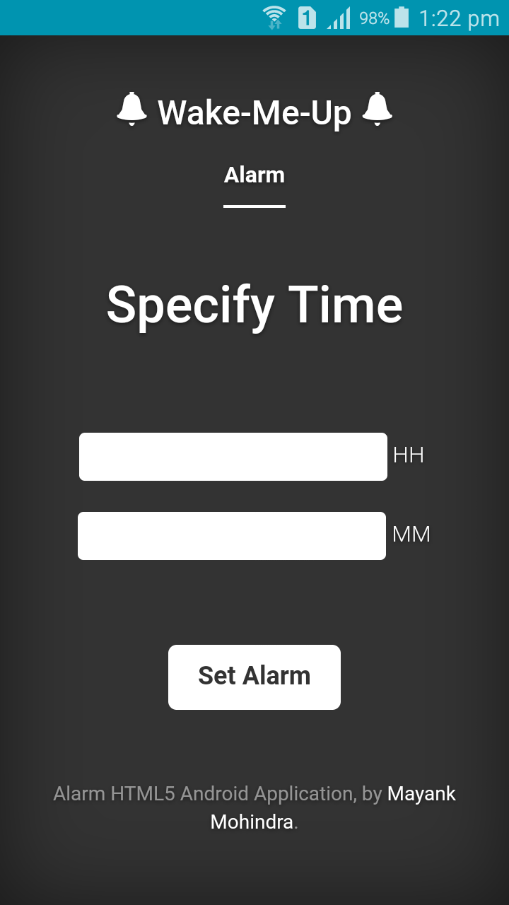
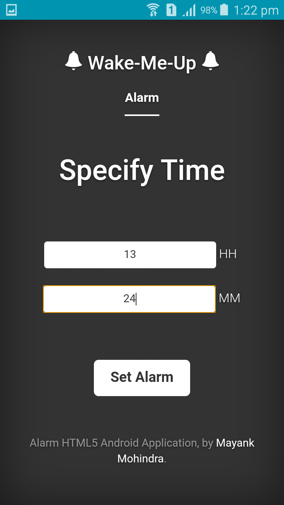
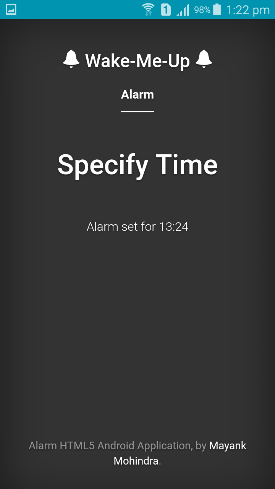
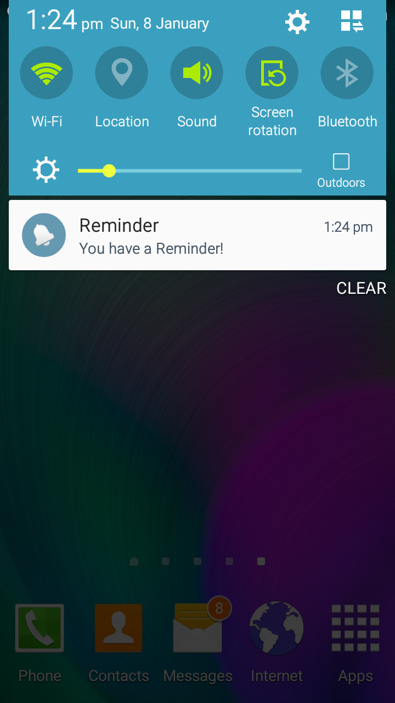

# Alarm-Cordova-Android
Android Alarm System Using Cordova and web development

Aim
----------
The main aim of the project is to access native code using HTML 5, that is plain html, css, and javascript.

What does the application do
----------
The application sets an alarm at a specific time and uses a pending intent. It then displays the notification when the pending intent "comes of age...:P", along with the specified sound.

Technologies Used
----------
- HTML
- CSS
- Javascript
- Cordova
- Android Studio
- Java

ScreenShots
----------
 
 

Android Component Used
----------
The android -webview- is the most important component used over here.
Javascript in the webpages can access the native java methods and classes and access system services along with them.

How is this Helpful
----------
Clearly the web development is one of the dear friends of developers and coding android xml style front-end can be "heavy" :).
In such situations, we can make use of the technologies like bootstrap and other front-end web development techniques and program the entire UI that is very effective.

